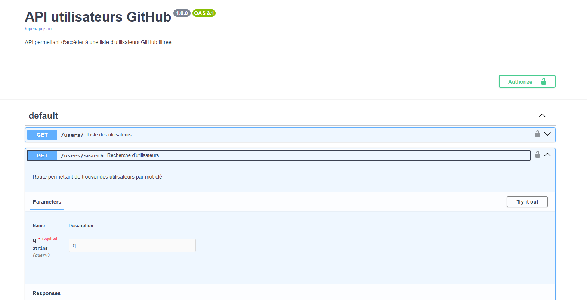
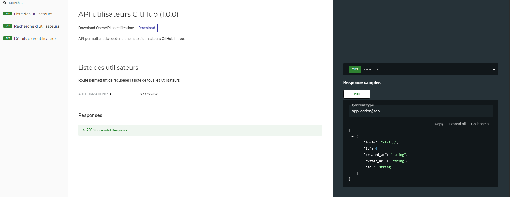
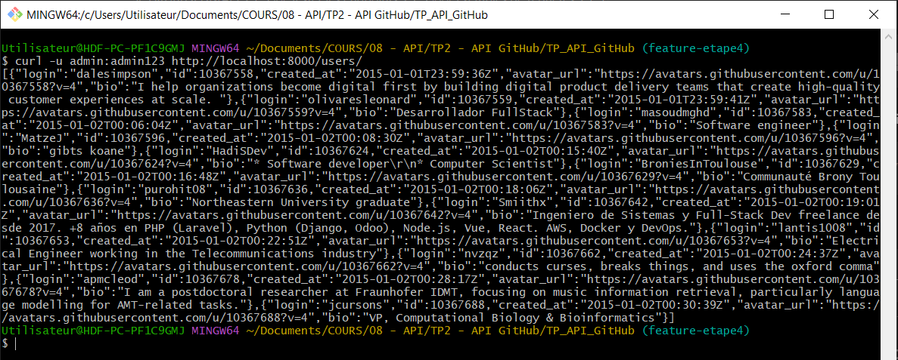
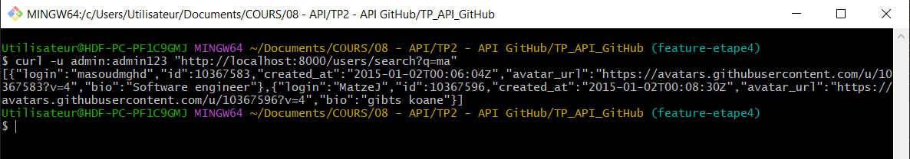
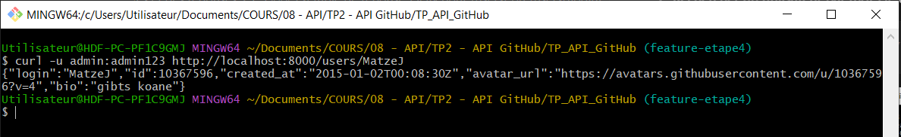
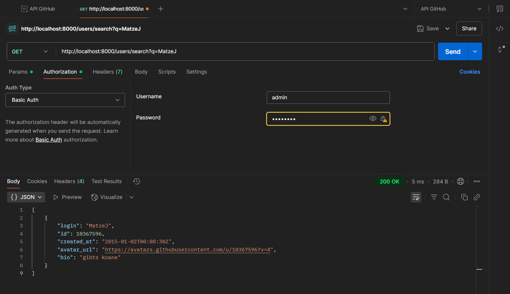

[](https://choosealicense.com/licenses/mit/)


# Création d'un pipeline d'API : de GitHub à FastAPI

## Description

Projet à but pédagogique consistant à construire un pipeline complet en Python : extraction de données depuis l’API publique de GitHub, nettoyage et filtrage des utilisateurs, puis mise à disposition via une API REST sécurisée avec FastAPI. Le projet permet d'aborder des notions essentielles telles que l’authentification, la gestion d’erreurs, la documentation API, le versionnement Git et la structuration de projet.  
  
*Réalisé par Aurélien Leva durant la formation de Développeur IA chez Simplon Hauts-de-France.*

---

## Arborescence du projet

```sh

TP_API_GITHUB/
│
├── extract_users.py            # Étape 1 : extraction brute depuis GitHub
├── filtered_users.py           # Étape 2 : nettoyage et filtrage
│
├── api/
│   ├── main.py                 # Lancement de l’API FastAPI
│   ├── models.py               # Schémas Pydantic
│   ├── routes.py               # Endpoints de l’API
│   └──security.py             # Authentification
│
├── data/
│   └── filtered_users.json     # Données filtrées prêtes pour l’API
│   └── users.json              # Données brutes 
│
├── tests/
│   └── test_api.py             # Tests API (bonus)
│
├── requirements.txt            # Bibliothèques à installer
├── .env                        # Token GitHub & authentification API
└── README.md                   # Documentation du projet
```

## Scripts

- **extract_users.py**  
  Extrait un nombre défini d’utilisateurs depuis l’API GitHub et sauvegarde les informations principales dans `data/users.json`.

- **filtered_users.py**  
  Filtre les utilisateurs extraits pour ne conserver que ceux ayant une bio, un avatar et un compte créé à partir de 2015. Le résultat est sauvegardé dans `data/filtered_users.json`.

- **API FastAPI**  
  Le dossier `api/` contient le code de l’API permettant d’exposer les utilisateurs filtrés via plusieurs endpoints sécurisés :  

    - **main.py**
    ➜ Démarre l’application FastAPI et connecte les routes.  
    *(Point d’entrée de l’API avec uvicorn.)*

    - **routes.py**
    ➜ Définit les différentes routes/endpoints (/users/, /users/{login}, /users/search).  
    *(Logique pour répondre aux requêtes.)*

    - **models.py**
    ➜ Définit les modèles de données avec Pydantic (structure des utilisateurs).  
    *(Structure et validation des réponses JSON.)*

    - **security.py**
    ➜ Gère l’authentification via HTTP Basic Auth.  
    *(Protection des routes avec identifiants.)*

---

## Instructions

### 1. Prérequis

- Python 3.8+
- Installer les dépendances :
  ```sh
  pip install -r requirements.txt
  ```
- Renseigner un token GitHub personnel et les identifiants API dans le fichier `.env` (voir `.env.example`).

### 2. Exécuter le script d’extraction

```sh
python extract_users.py --max-users 60
```
- Le paramètre `--max-users` permet de définir le nombre d’utilisateurs à extraire (par défaut : 60).

### 3. Filtrer les utilisateurs

```sh
python filtered_users.py
```
- Génère le fichier `data/filtered_users.json` avec les utilisateurs filtrés.

### 4. Lancer l’API FastAPI

```sh
uvicorn api.main:app --reload
```
- L’API sera accessible sur [http://localhost:8000](http://localhost:8000).


---

## Tester les endpoints

### Accès sécurisé

Toutes les routes sont protégées par une authentification HTTP Basic (voir identifiants dans `.env`).

### Documentation interactive

- Swagger UI : [http://localhost:8000/docs](http://localhost:8000/docs)  



- Redoc : [http://localhost:8000/redoc](http://localhost:8000/redoc)  



### Exemples de requêtes

>[!WARNING]
>Attention si vous êtes sous Windows : ces commandes ne fonctionnent pas via le Powershell. Veuillez passer par un Git Bash, ou directement par l'interface Swagger.

#### 1. Récupérer tous les utilisateurs

```sh
curl -u admin:admin123 http://localhost:8000/users/
```  



#### 2. Rechercher un utilisateur par mot-clé dans le login *(ici les login contenant "ma")*

```sh
curl -u admin:admin123 "http://localhost:8000/users/search?q=ma"
```  



#### 3. Détails d’un utilisateur

```sh
curl -u admin:admin123 http://localhost:8000/users/MatzeJ
```  



---

## Format attendu des requêtes et des réponses

### Exemple de réponse JSON pour `/users/` ou `/users/{login}`

```json
[
  {
    "login": "MatzeJ",
    "id": 10367596,
    "created_at": "2015-01-02T00:08:30Z",
    "avatar_url": "https://avatars.githubusercontent.com/u/10367596?v=4",
    "bio": "gibts koane"
  }
]
```

### Exemple de requête de recherche

**Requête :**
```
GET /users/search?q=brony
```

**Réponse :**
```json
[
  {
    "login": "BroniesInToulouse",
    "id": 10367629,
    "created_at": "2015-01-02T00:16:48Z",
    "avatar_url": "https://avatars.githubusercontent.com/u/10367629?v=4",
    "bio": "Communauté Brony Toulousaine"
  }
]
```  

---
### Exemple Postman :



---

## Remarques

- Les identifiants d’accès à l’API sont à configurer dans un fichier `.env` (voir .env.example).
- Le projet respecte la séparation extraction, traitement et exposition des données.
- Voir la documentation Swagger pour plus de détails sur les endpoints et les schémas de données.